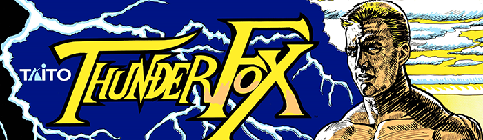
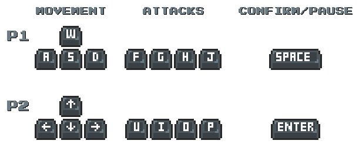
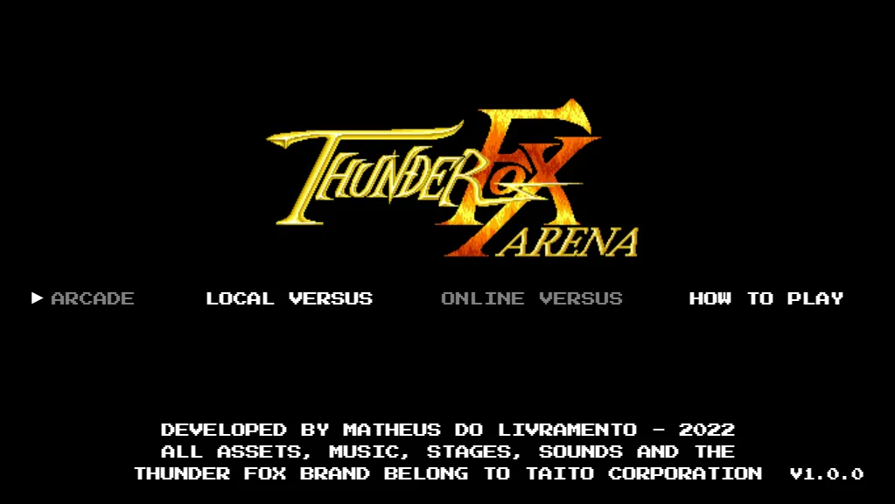
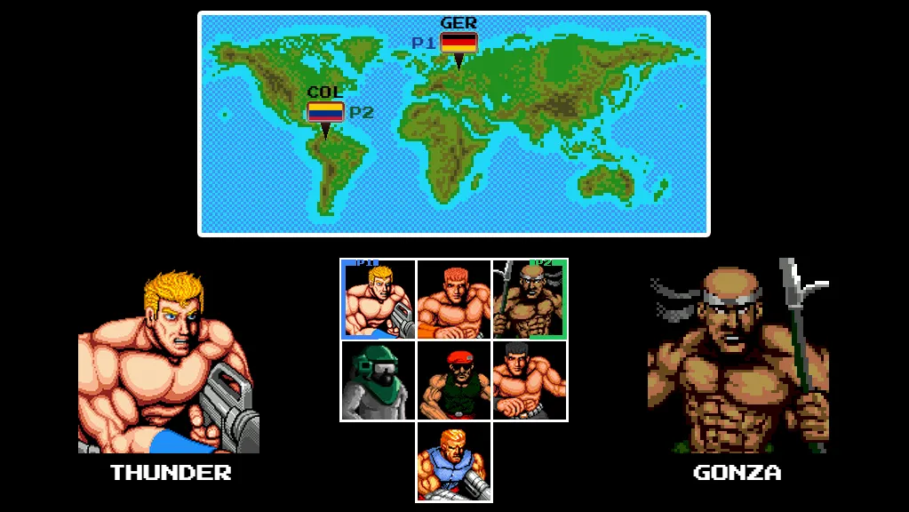
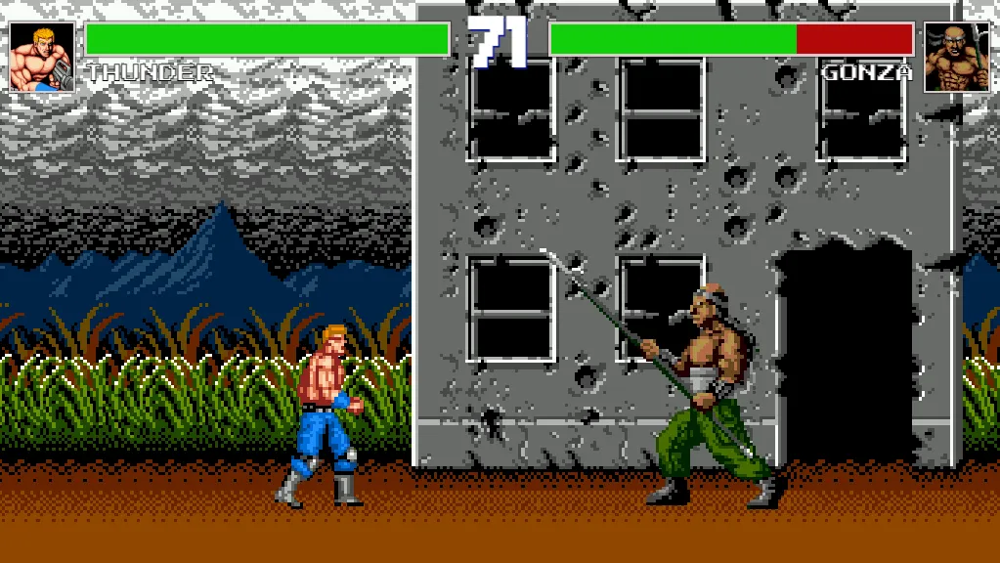
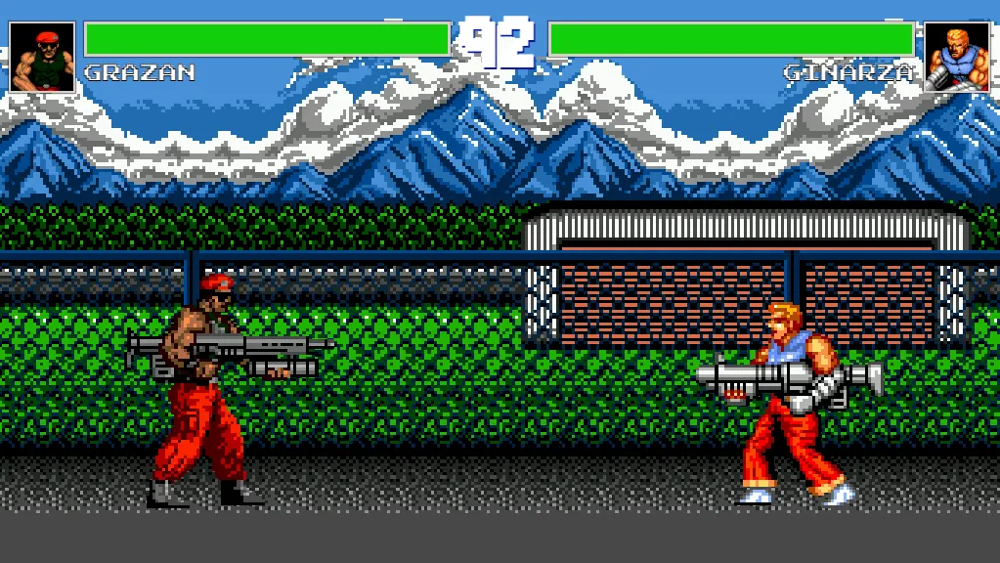

****

 

<ul>
<li><a href="#english-documentation">English documentation</a></li>
<li><a href="#documentação-em-português">Documentação em português</a></li>
</ul>

<h1 id="english-documentation">English Documentation</h1>

<h2>📜 Table of content</h2>

<ul>
    <li><a href="#legal">Legal - Information to Taito</a></li>
    <li><a href="#how-to-play">How To Play</a></li>
    <li><a href="#current-status">Current Status</a></li>
    <li><a href="#about-the-project">About the project</a></li>
    <li><a href="#live-demo">Live demo</a></li>
    <li><a href="#technologies-front">Technologies</a></li>
    <li><a href="#code-contributing">Code/Contributing</a></li>
    <li><a href="#author">Author</a></li>
</ul>

<h2 id="legal">⚠ Legal - Information to Taito</h2>

    All assets, music, stages, sounds and the Thunder Fox brand belong to Taito Corporation.

    As stated on the "About" page, this game was developed as a homage to the original Thunder Fox released 
    back in 1991, for beign a game that makes a important part of my life, bringing back good childhood memories.

    I developed the game under <b>Fair Use</b>, and I intend no harm to Taito Corporation. Also, I get 
    absolutely zero financial return for this project.

<ul>
    <li>I take <b>no profits</b> from Thunder Fox Arena.</li>
    <li>I <b>don't sell</b> Thunder Fox Arena.</li>
    <li>I <b>will never</b> monetize Thunder Fox Arena in any shape or form.</li>
</ul>

<h2 id="how-to-play">🎮 How to Play?</h2>

<h2 id="current-status">⌚ Current Status</h2>

    In this section, I'll constantly update Thunder Fox Arena current status.

    <b>Start date:</b> May, 9th 2022
     
    <b>End date:</b> August, 1st 2022
     
    <b>Hours taken:</b> ~95
     
    <b>Status:</b> Complete

<h2 id="about-the-project">💻 About the project</h2>

    <b>Thunder Fox Arena</b> is a 1 vs 1 reimagination made in JavaScript of the original 1991 game released 
    for Sega Mega Drive.

    As a developer, I constantly build stuff in my free time in order to improve my skills, but, even after 
    more than five years of experience with programming, I never took the time to build a game as I always stuck with "traditional" softwares.

    I'm a big time gamer, starting my career on my early ages, so, the process to decide which game I was 
    going to build was rather simple: recreate a 1 vs 1 version of the first game that I played, when I was 
    4 or 5 years old. Thunder Fox really has its own place in my heart.

    Another factor that inspired me to make this game, was a <a target="_blank" 
    href="https://www.youtube.com/watch?v=vyqbNFMDRGQ">YouTube video</a> that was suggested to me about 
    JavaScript game development. Even though I'm an experienced developer, I was jumping into <em>unknown 
    territory</em>, since this is my first game ever developed, so, this video tutorial taught me some solutions
    that I probably wouldn't be able to come up with on my own.

<h2 id="live-demo">🌐 Live demo</h2>

Check out this project running on <a href="https://livramatheus.github.io/thunder-fox-arena/">GitHub Pages</a>

<h3 id="technologies-front">🔨 Technologies</h3>

    This project was developed with <b>HTML, CSS and JavaScript</b>. The only third-party library used was <a href="https://createjs.com/preloadjs" target="_black">preloadjs</a> in order to prevent broken sprites and delayed sounds.

    A crucial tool for the progress of the project was a modified version of the <b>Gens emulator</b>, which was used to individually extract all sprites from the original game. To create the Sprite Sheets, animations and image manipulations in general, <b>Adobe Photoshop</b> was used.

<h3 id="code-contributing">👨‍💻 Code/Contributing</h3>

    Thunder Fox Arena is an open source project. Be free to open new issues or Merge Requests in order to improve the project.

<h3 id="author">👩‍🦲 Author</h3>

Developed by <strong>Matheus do Livramento</strong>.

<a href="https://github.com/livramatheus">GitHub</a> | <a href="https://www.linkedin.com/in/livramatheus">LinkedIn</a> | <a href="https://www.livramento.dev/">Website</a>

<h1 id="documentação-em-português">Documentação em português</h1>
<h2>📜 Tabela de conteúdo</h2>

<ul>
    <li><a href="#how-to-play-br">Como Jogar</a></li>
    <li><a href="#current-status-br">Status Atual</a></li>
    <li><a href="#about-the-project-br">Sobre o projeto</a></li>
    <li><a href="#live-demo-br">Live demo</a></li>
    <li><a href="#technologies-front-br">Tecnologias</a></li>
    <li><a href="#code-contributing-br">Código/Contribuindo</a></li>
    <li><a href="#autor-br">Autor</a></li>
</ul>

<h2 id="how-to-play-br">🎮 Como Jogar?</h2>

<h2 id="current-status-br">⌚ Status Atual</h2>

    Nesta seção, irei atualizar constantemente o estado atual do Thunder Fox Arena.

    <b>Data de início:</b> 9 de maio de 2022
     
    <b>Data de fim:</b> 1 de agosto de 2022
     
    <b>Horas de trabalho:</b> ~95
     
    <b>Status:</b> 100%

<h2 id="about-the-project-br">💻 Sobre o projeto</h2>

    <b>Thunder Fox Arena</b> é uma reimaginação 1 vs 1 feita em JavaScript do jogo originalmente lançado em 1991 para Sega Mega Drive.

    Como desenvolvedor, constantemente construo coisas no meu tempo livre para melhorar minhas habilidades, mas, mesmo depois de mais de cinco anos de experiência com programação, nunca tive a ideia de desenvolver um jogo, por sempre estar focado em softwares "tradicionais".

    Eu sou um <em>gamer</em> de longa data, começando minha carreira muito cedo, então, o processo para decidir qual jogo que eu iria desenvolver foi bem simples: recriar uma versão 1 vs 1 do primeiro jogo que joguei, quando eu tinha por volta de 4 ou 5 anos. Thunder Fox tem seu próprio lugar no meu coração.

    Outro fator que me inspirou a fazer este jogo, foi um <a target="_blank" 
    href="https://www.youtube.com/watch?v=vyqbNFMDRGQ">vídeo do YouTube</a> que me foi sugerido sobre desenvolvimento de jogos em JavaScript. Mesmo que eu seja um um desenvolvedor experiente, jogos estão fora da minha <em>zona de conforto</em>, então este tutorial me ensinou algumas soluções que eu provavelmente não conseguiria encontrar sozinho.

<h2 id="live-demo-br">🌐 Live demo</h2>

Veja este projeto rodando no <a href="https://livramatheus.github.io/thunder-fox-arena/">GitHub Pages</a>

<h3 id="technologies-front-br">🔨 Tecnologias</h3>

    Este projeto foi desenvolvido apenas com <b>HTML, CSS e JavaScript</b>. A única biblioteca de terceiros utilizada foi o <a href="https://createjs.com/preloadjs" target="_black">preloadjs</a> para previnir sprites quebrados ou atrasos no carregamento de sons.

    Uma ferramenta indispensável pro andamento do projeto foi uma versão modificada do <b>emulador Gens</b>, que foi utilizada para extrair individualmente todos sprites do jogo original. Para a criação dos Sprite Sheets, animações e manipulações de imagem em geral, foi utilizado o <b>Adobe Photoshop</b>.

<h3 id="code-contributing-br">👨‍💻 Código/Contribuindo</h3>

    Thunder Fox Arena é um projeto de código aberto. Fique à vontade para abrir novas issues ou merge requests para melhorar o projeto.

<h3 id="autor-br">👩‍🦲 Autor</h3>

Desenvolvido por <strong>Matheus do Livramento</strong>.

<a href="https://github.com/livramatheus">GitHub</a> | <a href="https://www.linkedin.com/in/livramatheus">LinkedIn</a> | <a href="https://www.livramento.dev/">Website</a>

